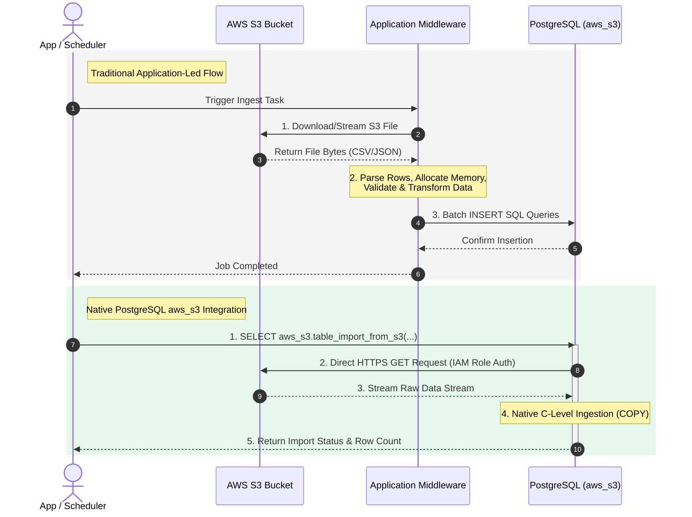
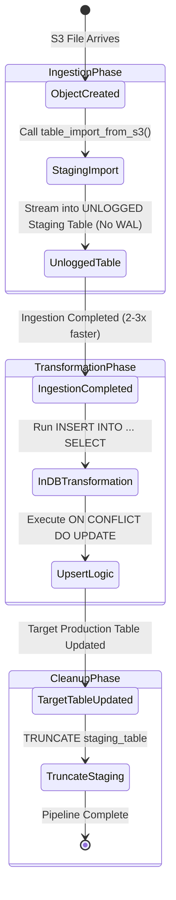

In modern cloud architectures, ingest processes frequently require loading bulk dataset files (such as CSVs, TSVs, or custom text dumps) stored in Amazon S3 directly into a PostgreSQL database.

The traditional approach involves an application service—written in Node.js, Python, or Go—that downloads the S3 object, buffers or streams it in memory, parses rows, transforms data, and executes batch SQL `INSERT` commands into Postgres.

While functional for smaller files, this pattern introduces significant inefficiencies:
- **Application Overhead**: Memory consumption and CPU saturation on your application pods.
- **Double Network Hop**: Traffic flows from S3 to the App Server, and then from the App Server to PostgreSQL.
- **Latency & Throughput Bottlenecks**: Application-side parsing and ORM serialization severely throttle ingestion throughput.

By taking advantage of the native **`aws_s3`** and **`aws_commons`** extensions available in AWS RDS and Aurora PostgreSQL, you can eliminate application middleware entirely. The database engine streams data directly to and from S3 at native C speed.

Here is a step-by-step guide to configuring and using native S3 file imports and exports in PostgreSQL.

---

## Architecture Overview: Application-Led vs Native Database Integration



In the native flow:
1. The application or scheduler triggers a single SQL command (`SELECT aws_s3.table_import_from_s3(...)`).
2. PostgreSQL initiates a direct secure connection to Amazon S3 using IAM credentials.
3. Data is streamed straight into target tables using internal engine optimizations similar to `COPY FROM`.

---

## Step 1: Configuring AWS IAM Permissions

Before executing SQL queries, your RDS or Aurora PostgreSQL instance must be granted permission to access S3.

### 1. Create an IAM Policy
Create an IAM Policy (e.g., `PostgreSQL-S3-Access-Policy`) with permissions for your S3 bucket:

```json
{
  "Version": "2012-10-17",
  "Statement": [
    {
      "Sid": "S3BucketAccess",
      "Effect": "Allow",
      "Action": [
        "s3:GetObject",
        "s3:ListBucket",
        "s3:PutObject"
      ],
      "Resource": [
        "arn:aws:s3:::my-data-ingestion-bucket",
        "arn:aws:s3:::my-data-ingestion-bucket/*"
      ]
    }
  ]
}
```

### 2. Create an IAM Role & Attach to RDS
1. Create an IAM Role for RDS (`rds.amazonaws.com`).
2. Attach the `PostgreSQL-S3-Access-Policy`.
3. In the AWS Management Console or via AWS CLI / Terraform, attach this IAM Role to your RDS PostgreSQL instance under **Connectivity & security -> IAM roles**.

---

## Step 2: Enabling Extensions in PostgreSQL

Connect to your PostgreSQL database as a superuser or standard administrator role (`postgres` or `rds_superuser`) and enable `aws_commons` and `aws_s3`:

```sql
-- Enable required extensions
CREATE EXTENSION IF NOT EXISTS aws_commons;
CREATE EXTENSION IF NOT EXISTS aws_s3;

-- Verify extension installation
SELECT extname, extversion FROM pg_extension WHERE extname LIKE 'aws_%';
```

---

## Step 3: Importing Files Directly from S3 to PostgreSQL

Let's assume we have a CSV file located at `s3://my-data-ingestion-bucket/raw/users_2026.csv`.

### 1. Create Target Table
Create a destination table matching the structure of the incoming CSV file:

```sql
CREATE TABLE users_import (
    id UUID PRIMARY KEY,
    email VARCHAR(255) NOT NULL,
    full_name VARCHAR(150),
    created_at TIMESTAMP WITH TIME ZONE DEFAULT CURRENT_TIMESTAMP
);
```

### 2. Execute Bulk Import
Use `aws_commons.create_s3_uri` and `aws_s3.table_import_from_s3`:

```sql
SELECT aws_s3.table_import_from_s3(
    'users_import',                     -- Target table name
    'id, email, full_name, created_at', -- Target columns (optional, leave '' for all)
    '(FORMAT csv, HEADER true, DELIMITER '','')', -- PostgreSQL COPY options
    aws_commons.create_s3_uri(
        'my-data-ingestion-bucket',     -- Bucket name
        'raw/users_2026.csv',           -- S3 object key
        'eu-west-1'                     -- AWS Region
    )
);
```

The database directly streams `users_2026.csv` into `users_import` in seconds without touching any application memory.

---

## Step 4: Exporting PostgreSQL Query Results Directly to S3

You can also dump table data or complex query results back to S3 without writing custom exporter scripts.

```sql
SELECT * FROM aws_s3.query_export_to_s3(
    'SELECT email, count(*) as login_count FROM user_activity GROUP BY email',
    aws_commons.create_s3_uri(
        'my-data-ingestion-bucket',
        'exports/user_summary_2026.csv',
        'eu-west-1'
    ),
    options := 'FORMAT csv, HEADER true'
);
```

---

## Advanced Architecture & Optimization Strategies

### 1. ELT Pattern with Unlogged Staging Tables
To achieve maximum ingestion speed for large files (millions of rows), follow an in-database ELT (Extract, Load, Transform) lifecycle:



1. **Use `UNLOGGED` Staging Tables**: Skipping Write-Ahead Logging (WAL) speeds up imports by 2-3x:
   ```sql
   CREATE UNLOGGED TABLE staging_users (LIKE users_import INCLUDING DEFAULTS);
   ```
2. **Import Data to Staging**:
   ```sql
   SELECT aws_s3.table_import_from_s3('staging_users', '', '(FORMAT csv, HEADER true)', ...);
   ```
3. **In-Database Transformation & Upsert**:
   Transform data inside Postgres using SQL (`INSERT INTO ... ON CONFLICT DO UPDATE`), leveraging PostgreSQL's query optimizer:
   ```sql
   INSERT INTO users_import (id, email, full_name)
   SELECT id, LOWER(email), TRIM(full_name)
   FROM staging_users
   ON CONFLICT (id) DO UPDATE SET email = EXCLUDED.email;
   
   -- Drop staging table data
   TRUNCATE TABLE staging_users;
   ```

### 2. Network & Cost Optimization: AWS S3 VPC Endpoints
When streaming large amounts of data between RDS and S3, configure an **S3 VPC Gateway Endpoint** in your VPC.
- **Zero Data Transfer Fees**: Traffic between RDS and S3 stays inside the AWS private network backbone without incurring NAT Gateway bandwidth fees.
- **Enhanced Security**: S3 traffic never traverses the public internet.

---

## Comparison: Application-Led vs Native Database S3 Ingestion

| Metric / Feature | Application-Led Processing | Native PostgreSQL `aws_s3` |
| :--- | :--- | :--- |
| **Ingestion Speed** | Moderate (App memory/CPU throttled) | Native C engine speed (`COPY`) |
| **App Pod Memory Use** | High (buffers large files) | Zero memory footprint on App |
| **Network Hop** | 2 hops (S3 -> App -> DB) | 1 direct hop (S3 -> DB) |
| **Maintenance** | Custom code, dependencies, ORM | Single declarative SQL query |
| **Data Security** | IAM keys/secrets managed by App | Native AWS IAM Role assigned to RDS |

---

## Conclusion

Integrating AWS S3 directly with PostgreSQL via the `aws_s3` extension flips traditional file processing on its head. Instead of building complex backend parsers and data streaming pipelines, you leverage the database engine for what it does best: ultra-fast data handling.

By combining `aws_s3.table_import_from_s3` with `UNLOGGED` staging tables and S3 VPC Gateway Endpoints, you build an enterprise-grade ELT pipeline that is cheaper, faster, and completely maintainable with plain SQL.
