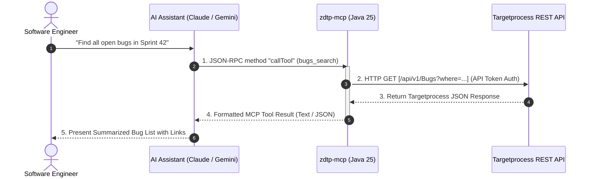

Managing project management tools like **Apptio Targetprocess** often involves navigating dense web interfaces, updating task statuses, and searching for entity relations across sprints.

With the rise of AI coding agents and assistants—such as **Claude Code CLI**, **Gemini CLI**, **Cursor**, and **Claude Desktop**—software engineers need a seamless bridge to inspect, create, and update Targetprocess backlog items directly from their terminal or IDE.

To solve this, I built **[zdtp-mcp](https://github.com/aldo-lushkja/zdtp-mcp)**: a lightweight, zero-framework Model Context Protocol (MCP) server for Targetprocess written in pure **Java 25**.

Here is a dive into why `zdtp-mcp` was created, its architecture, and how you can get started in seconds.

---

## What is Model Context Protocol (MCP)?

The **Model Context Protocol (MCP)** is an open standard introduced by Anthropic that enables AI models to safely interface with external tools, APIs, and databases. Instead of writing custom API integration scripts for every AI client, an MCP server exposes a standardized set of tools, resources, and prompts over `stdio` or `HTTP/SSE`.

By adding `zdtp-mcp` to your AI client, your AI assistant can execute natural language prompts like:
- *"Find all high-priority open bugs assigned to me in Sprint 42"*
- *"Create a User Story for the payment gateway integration under Epic EP-102"*
- *"Link User Story US-456 as a blocker for US-789"*
- *"Generate a test plan with test steps for the auth service refactor"*

---

## Why Pure Java 25 & Zero Frameworks?

Many enterprise MCP servers are built using bulky frameworks like Spring Boot or Quarkus, or reliance on heavy Node.js runtimes. For a CLI tool or background daemon, framework overhead introduces delayed cold-start times and high memory usage.

`zdtp-mcp` was designed from the ground up with a **zero-framework** philosophy:

1. **Near-Instant Cold Start**: Zero reflection scanning, no heavy dependency injection containers. Starts in milliseconds.
2. **Pure Java 25**: Utilizes modern Java 25 features (virtual threads, pattern matching, records) for clean, high-concurrency standard I/O and HTTP processing.
3. **GraalVM Native Image Support**: Can be compiled into a standalone, single-file native executable (`zdtp-mcp`) requiring zero JVM installation on host machines.
4. **Low Memory Footprint**: Operates comfortably under 30MB of RAM in Docker containers.

---

## Architecture: How `zdtp-mcp` Connects AI Agents to Targetprocess


<details>
<summary>View Mermaid Source Code</summary>



</details>

---

## Comprehensive Toolset (52 Tools Across 15 Domains)

`zdtp-mcp` exposes 52 specialized tools covering complete CRUD and relational operations:

| Domain | Available Operations |
| :--- | :--- |
| **User Stories** | `search`, `create`, `update`, `get`, `delete` |
| **Tasks** | `search`, `create`, `update`, `get`, `delete` |
| **Bugs** | `search`, `create`, `update`, `get`, `delete` |
| **Epics & Features** | `search`, `create`, `update`, `get`, `delete` |
| **Releases & Sprints** | `search`, `get`, `create`, `update`, `delete` |
| **Test Plans & Cases** | `search`, `create`, `update`, `get`, `delete`, `add_step`, `delete_step` |
| **Relations & Links** | `search`, `create` (Blocker, Relation, Dependency), `delete` |
| **Comments & History** | `add_comment`, `list_comments` |

---

## 🚀 Quick Start Guide

### 1. Claude Code CLI

Run `zdtp-mcp` instantly using Docker:

```bash
claude mcp add zdtp -- docker run -i --rm \
  -e TP_URL="https://youraccount.tpondemand.com" \
  -e TP_TOKEN="your_api_token" \
  ghcr.io/aldo-lushkja/zdtp-mcp:latest
```

### 2. Gemini CLI

```bash
gemini mcp add zdtp docker run -i --rm \
  -e TP_URL="https://youraccount.tpondemand.com" \
  -e TP_TOKEN="your_api_token" \
  ghcr.io/aldo-lushkja/zdtp-mcp:latest
```

### 3. Claude Desktop Configuration (`claude_desktop_config.json`)

```json
{
  "mcpServers": {
    "zdtp": {
      "command": "docker",
      "args": [
        "run", "-i", "--rm",
        "-e", "TP_URL=https://youraccount.tpondemand.com",
        "-e", "TP_TOKEN=your_api_token",
        "ghcr.io/aldo-lushkja/zdtp-mcp:latest"
      ]
    }
  }
}
```

---

## Building Native Binaries with GraalVM

For environments where Docker overhead is unwanted, `zdtp-mcp` supports direct GraalVM compilation into a native binary:

```bash
# Clone the repository
git clone https://github.com/aldo-lushkja/zdtp-mcp.git
cd zdtp-mcp

# Build native binary with Gradle & GraalVM Native Image
./gradlew nativeBuild

# Run the native binary directly
./build/native/zdtp-mcp
```

---

## Open Source & Contributing

`zdtp-mcp` is completely open source under the MIT license. Check out the repository on GitHub to contribute, report issues, or star the project:

👉 **[GitHub Repository: aldo-lushkja/zdtp-mcp](https://github.com/aldo-lushkja/zdtp-mcp)**
